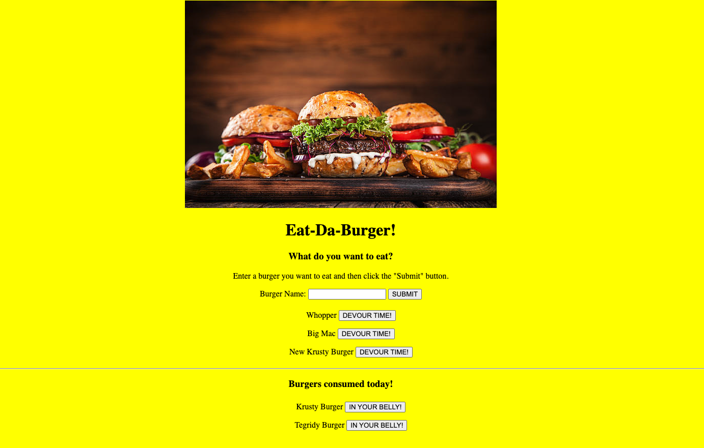

# burger

David K. Brown's Eat-Da-Burger App

## Table of Contents

- [Description](#description)

- [Screenshots](#screenshots)

- [Acceptance-Criteria](#Acceptance-Criteria)

- [Installation](#installation)

- [Credits](#credits)

- [Contributing](#contributing)

- [Copyright](#copyright)

## Description

The purpose of this project was to create an application that logs burgers using MySQL, Node, Express, Handlebars and a homemade ORM. The application follows the MVC design pattern and Handlebars to generate the HTML. From a user perspective they are able to submit new burgers and click a button to "devour" burgers which are tracked/saved in the database.

## Screenshots



## Acceptance-Criteria

```md
Application should allow users to input the names of burgers they'd like to eat.

Whenever a user submits a burger's name the app will display it waiting to be devoured.

Each burger has a Devour It button that when clicked moves it to the devoured section.

All of the burgers are stored in the database.
```

## Installation

To access this project you will need to visit my GitHub page and the "Burger" repository. After the repository is cloned/forked you can make edits to the project in your repository. Any questions should be directed to [David Brown](mailto:gatech55@gmail.com). The project can be found here: [Buger](https://github.com/GaTech55/burger). The Heroku site can be found here: [Heroku_Burger](https://polar-inlet-14628.herokuapp.com/).

## Credits

© 2019 Trilogy Education Services, a 2U, Inc. brand. All Rights Reserved.
[GitLab-13-Homework](https://gt.bootcampcontent.com/GT-Coding-Boot-Camp/gt-inc-fsf-pt-08-2020-u-c/tree/master/13-MVC/02-Homework/Instructions)

## Contributing

| **Commits** | **Contributor** |

| 15| [GaTech55](https://github.com/GaTech55)|

## Copyright

Copyright (c) 2020 David Brown.
